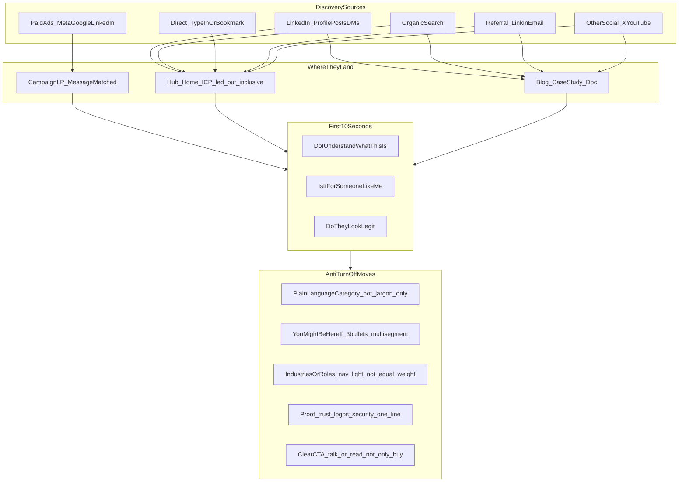
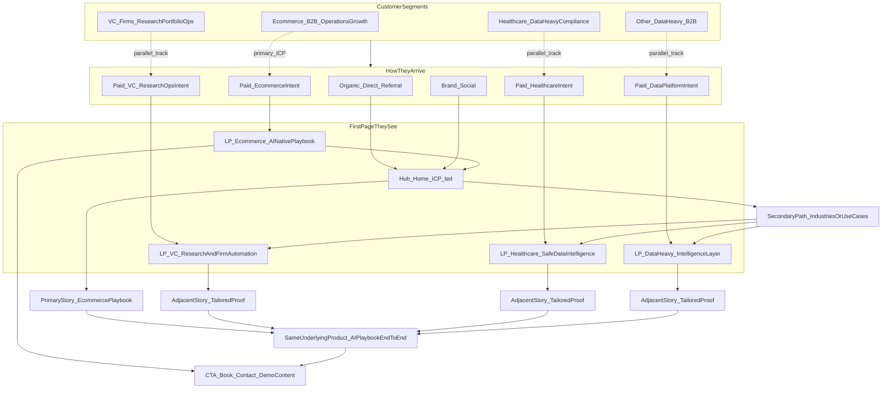
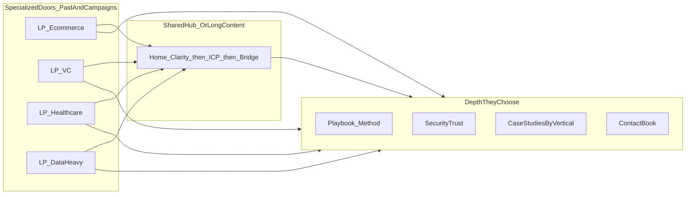

# Marketing site positioning — multi-audience, multi-channel

This document captures how to format the AiSolv site when **niching down on e-commerce** (AI-native playbook across the business) while still serving **VC**, **healthcare**, and **other data-heavy** companies without turning visitors away.

---

## Product story (spine)

- **Core offer**: An **AI-native playbook** across the business — from data intelligence through operations — positioned deeply for **e-commerce / B2B services** contexts.
- **Same spine for adjacent segments**: VC, healthcare, and data-heavy teams see **tailored entry and proof**, then the **same methodology and product narrative** (not a different company per vertical).

---

## Customer segments and discovery

| Who | Typical mindset | Where they often discover you |
|-----|-----------------|--------------------------------|
| E-commerce operator (ICP) | Fix ads, inventory, CX, ops — systems not slides | Ads (problem-led), Google, communities, podcasts |
| E-commerce founder | Scale without hiring an army | LinkedIn, intros, events |
| VC / deal team | Research, memos, CRM, portfolio ops — faster, repeatable | LinkedIn, intros, targeted ads, conferences |
| Healthcare / regulated | Data + AI with compliance first | LinkedIn, referrals, vertical content |
| Other data-heavy B2B | Pipelines, BI, agents on real data | LinkedIn, search, case-study links |
| Curious browser | What is this company? | Homepage, footer, press, job seekers |

**LinkedIn** often brings peers, investors, partners, and hires — not always buyers. The **homepage** must answer *what you do* in a few seconds without assuming they are already e-commerce.

---

## Traffic model: hub + campaign landing pages

- **Hub (home)**: **ICP-led** — e-commerce / playbook depth first. Organic, direct, brand social, and many LinkedIn visits land here.
- **Campaign LPs**: **Paid ads** (and tight partner campaigns) should send people to **message-matched** URLs: ad promise = headline = proof = CTA.
- **Content**: Blog and case studies can be entry points from search and shares; they should link clearly into the same spine and CTAs.

### Mermaid — sources → landing → first moments → anti bounce

### Mermaid — hub-and-spoke with shared product

### Mermaid — doors (LPs) vs hallway (hub)

---

## Recommended homepage section order (hub)

1. **Above the fold**: What you sell + **primary** for whom (e-commerce / AI-native playbook) — one clear line, not ten verticals.
2. **Micro-bridge** (compact): “Also work with venture, healthcare, and data-heavy teams” with links to **short vertical pages** (not a huge mega-menu of buzzwords).
3. **“You might be here if…”**: Three bullets (operator, data leader, investor ops) — each links to the right LP or in-page section.
4. **How the playbook works**: Same narrative spine for every segment (product depth).
5. **Proof**: Logos, outcomes, one-line security / governance where relevant.
6. **CTA**: Book / contact / read — not only “buy.”

**Campaign / vertical LPs**

- Headline matches the **channel and ad** (LinkedIn vs Meta can differ).
- Reuse the **same playbook diagram** and architecture story so it feels like **one product**, multiple skins.
- Regulated and VC copy emphasizes **governance, citations, audit, ownership** — different emphasis than e-com ROAS language, same underlying system.

---

## What turns people off (avoid on the hub)

- **Fake universality** — “everyone” with no sharp spine.
- **Hiding the niche** — if e-commerce is the strategy, the hero should show it; burying it reads as unfocused, not polite.
- **Hero wall of verticals** — reads like an agency laundry list.
- **No path for “not me”** — always offer one obvious link early: e.g. “Not e-commerce? See other industries,” without burying it in the footer only.

---

## LinkedIn-specific note

Traffic is often **skeptical professionals**. Lead with **clarity and dignity**: specific workflows, who owns outputs, and proof — not hype that sounds like “we automate your entire company overnight.”

---

## Ads and URL discipline

- Use **dedicated paths** per campaign where possible (examples: `/for/ecommerce`, `/for/vc`, `/for/healthcare`, `/for/data-teams`) so analytics and message match stay clean.
- UTM parameters align reporting; the **on-page headline** still must match the **ad creative**.

---

## One-line summary

**Hub = niche authority; LPs = campaign-specific front doors; shared middle = methodology + product + proof; one conversion layer.**

---

*Last updated from strategy discussion; not tied to a specific shipped route structure in the app until implemented.*
